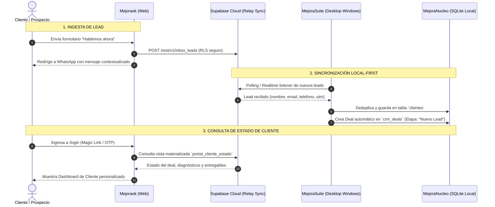

# Auditoría Técnica y Delta de Recableado — Mejoraok (Front-Desk)

**Autor:** Dev IA (Ejecutor Técnico de Antigravity)  
**Supervisión:** Arquitecto Técnico & Director General  
**Repositorio:** `Mejoraok` (`C:\github\Mejoraok`)  
**Fecha:** 28 de septiembre de 2026  
**Estado:** Documento de Auditoría y Especificación de Recableado

---

## 1. Resumen Ejecutivo y Diagnóstico del Repositorio

`Mejoraok` representa la **fachada digital pública y puerta de entrada (Front-Desk)** de todo el ecosistema *Mejora Continua*. Actualmente opera en una arquitectura moderna basada en **TanStack Router / Start + Vite + Tailwind CSS v4**, pero presenta una disociación entre su propósito comercial y su estructura interna de rutas.

```
┌─────────────────────────────────────────────────────────────┐
│                 ARQUITECTURA ACTUAL MEJORAOK                │
├──────────────────────────────┬──────────────────────────────┤
│    Ruta Pública (/)          │    Área Privada (/app)       │
│  - Landing Page Institucional│  - Template residual         │
│  - Captura modal de leads    │    (Habit Tracker/Continuum) │
│  - Redirección WhatsApp      │  - Desconectada de CRM/Suite │
│  - Enlace a Diagnóstico      │  - Auth Supabase genérico    │
└──────────────────────────────┴──────────────────────────────┘
```

### Hallazgos Principales:
1. **Landing de alta fidelidad visual (`/`):** La página principal (`src/routes/index.tsx`) implementa la identidad visual de Mejora Continua (Bw Modelica, paleta corporativa, micro-animaciones) y cuenta con un servicio funcional de captura asíncrona (`contactosService.ts`) que envía datos al endpoint legacy de Supabase Edge Functions.
2. **Componentes residuales en el área privada (`/app`, `/insights`, `/settings`):** Las rutas protegidas contienen un template de seguimiento de hábitos ("Continuum") que no guarda relación con la plataforma de negocios y debe ser completamente transformado en el **Portal de Clientes de Mejora Continua**.
3. **Puntos de integración activos pero desconectados del núcleo local:** Los leads capturados viajan a una Edge Function remota de Supabase, pero no se inyectan en tiempo real a la base de datos unificada de `MejoraSuite` en SQLite (`better-sqlite3`).

---

## 2. Inventario de Componentes y Puntos de Anclaje Actuales

### 2.1. Puntos de Captura y Conversión (Front-End Público)

| Elemento / Archivo | Tipo de Interacción | Destino Actual | Limitación Actual |
| :--- | :--- | :--- | :--- |
| **Modal "Hablemos ahora"**<br>`src/routes/index.tsx#L56-78` | Formulario de captura (`nombre`, `email`, `telefono`) | `syncLeadToContactos()` -> Supabase Edge Function (`contactos-api`) | Si la Edge function falla o la cuota vence, cae a WhatsApp sin trazabilidad en CRM |
| **Botón Directo WhatsApp**<br>`src/services/contactosService.ts#L23-25` | Enlace `https://wa.me/5493764358152` | Apertura de cliente WhatsApp con mensaje predeterminado | No registra el lead en la base local antes de abrir el chat |
| **Banner Diagnóstico Online**<br>`src/routes/index.tsx#L32` | Hipervínculo externo | Redirección a `https://diagnostico.mejoraok.com` | No hay unificación de sesión entre el diagnóstico y el portal |
| **Telemetría Local**<br>`src/services/contactosService.ts#L44-61` | Guardado en `localStorage` | Claves `mejoraok_event_*` | Datos aislados en el navegador del visitante, no consolidables en la Suite |

### 2.2. Sistema de Autenticación y Rutas Privadas

| Archivo | Funcionalidad | Integración |
| :--- | :--- | :--- |
| `src/routes/login.tsx` | Login / Registro con Email + Password y Google OAuth | `@supabase/supabase-js` + `@lovable.dev/cloud-auth-js` |
| `src/routes/app.tsx` | Dashboard del cliente (actualmente habit tracker) | `localStorage` + Supabase (`fetchHabitsFromCloud`) |
| `src/routes/insights.tsx` | Estadísticas del usuario | Cálculos de rachas locales |
| `src/routes/settings.tsx` | Preferencias y cierre de sesión | Supabase Auth sign-out |

---

## 3. Plan de Recableado: Del Sitio Estático al Portal Dinámico

El objetivo es convertir a `Mejoraok` en un portal bidireccional:
- **Flujo de Ingesta (Entrada):** Inyecta leads automáticamente en `MejoraContactos` y crea oportunidades en `MejoraCRM`.
- **Flujo de Autogestión (Salida):** Permite a clientes autenticados ver el estado de sus proyectos, diagnósticos y contratos contra la base unificada de `MejoraSuite`.



---

## 4. Especificación Técnica de los Módulos de Recableado

### 4.1. Módulo A: Nuevo Pipeline de Ingesta de Leads (`leadCaptureService.ts`)
Reemplazar `contactosService.ts` por un cliente robusto que guarde directamente en una tabla `inbox_leads` en Supabase con esquema estructurado:

```typescript
export interface IngestionLeadPayload {
  nombre: string;
  email?: string;
  telefono: string;
  empresa?: string;
  cargo?: string;
  interes_principal: 'comunidad' | 'consultoria' | 'diagnostico' | 'capacitacion';
  utm_source?: string;
  utm_medium?: string;
  utm_campaign?: string;
  origen_url: string;
}
```

#### Protocolo de Inyección:
1. Inserción directa en la tabla `inbox_leads` de Supabase usando la `anon_key` protegida con RLS (Insert Only).
2. Si la conexión de red falla, persistencia de reintento en IndexedDB (`pending_leads_queue`) con sync automático cuando regrese la conexión.
3. Apertura inmediata del enlace contextualizado de WhatsApp hacia el número oficial de Mejora Continua (`5493764358152`).

### 4.2. Módulo B: Transformación del Área Privada (`/app`) a "Portal del Cliente"
Eliminar completamente el código residual del habit tracker y reescribir los componentes de `src/routes/app.tsx`:

```
src/routes/
├── index.tsx                 # Landing institucional y captura
├── login.tsx                 # Acceso clientes (Email OTP / WhatsApp OTP)
└── app/
    ├── dashboard.tsx         # Resumen general del cliente
    ├── diagnostico.tsx       # Resultados del Diagnóstico Empresarial
    ├── propuestas.tsx        # Propuestas comerciales y entregables
    └── contacto-directo.tsx  # Solicitud de turnos / soporte directo
```

#### Vistas del Portal de Cliente:
1. **Estado de mi Proceso Comercial:**
   - Muestra visualmente la barra de avance del cliente en el embudo de `MejoraCRM`:
     *1. Contacto Inicial* -> *2. Diagnóstico Relevado* -> *3. Plan Estratégico* -> *4. Ejecución en Curso*.
2. **Ficha del Negocio:**
   - Visualización de datos de su empresa relevados en el diagnóstico (industria, tamaño de equipo, desafíos críticos).
3. **Bandeja de Entregables:**
   - Enlaces a reportes en PDF generados por `MejoraDiagnostico` almacenados en storage seguro.

### 4.3. Módulo C: Arquitectura del Puente Cloud-Local (Relay Sync)

Dado que `MejoraSuite` vive en la máquina Windows local con `better-sqlite3`, se utiliza Supabase exclusivamente como **buzón de intercambio desacoplado (Relay)**:

1. **Tabla de Buzón de Entrada (`inbox_leads` en Cloud):**
   - La web `Mejoraok` solo escribe en esta tabla.
   - `MejoraSuite` ejecuta un worker en segundo plano (cada 60 segundos o vía Supabase Realtime WebSocket) que:
     - Lee los nuevos registros de `inbox_leads`.
     - Ejecuta el algoritmo de deduplicación de `MejoraContactos` contra la base SQLite local.
     - Inserta el contacto en la tabla local `clientes`.
     - Crea la tarjeta correspondiente en `crm_deals` dentro de `MejoraCRM`.
     - Marca el registro en la nube como `procesado = true`.
2. **Tabla de Estado de Clientes (`portal_clientes_sync` en Cloud):**
   - Cuando el operador en `MejoraSuite` avanza una etapa en el CRM local, el servicio de sincronización de la Suite actualiza la fila del cliente en `portal_clientes_sync`.
   - Cuando el cliente entra a `mejoraok.com/app`, lee su estado sincronizado sin necesidad de que la web tenga acceso directo a la IP de la máquina local.

---

## 5. Matriz de Cambios de Código Requeridos (Delta)

| Archivo en `Mejoraok` | Acción Requerida | Detalle Técnico |
| :--- | :--- | :--- |
| `src/routes/index.tsx` | Modificar | Adaptar el modal para capturar `empresa` e `interés` opcionales; apuntar al nuevo `leadCaptureService`. |
| `src/services/contactosService.ts` | Refactorizar / Reemplazar | Migrar a `leadCaptureService.ts` con tipado estricto y fallback offline en IndexedDB. |
| `src/routes/app.tsx` | Reescribir por completo | Eliminar dependencias de `habits.ts` y montar el `ClientPortalDashboard`. |
| `src/routes/insights.tsx` | Reescribir | Reemplazar rachas de hábitos por métricas empresariales del cliente. |
| `src/lib/habits.ts` / `habits-cloud.ts` | Eliminar | Archivos residuales del template previo. |
| `src/integrations/supabase/` | Actualizar | Configurar esquemas de cliente para `inbox_leads` y `portal_clientes`. |

---

## 6. Próximos Pasos de Ejecución

1. **Aprobación de la Arquitectura de Datos por el Arquitecto Técnico.**
2. **Creación de la tabla `inbox_leads` en Supabase con políticas RLS de inserción anónima y lectura restringida.**
3. **Reemplazo de los componentes de `/app` en `Mejoraok` para vincularlos a los datos reales de clientes.**
4. **Construcción del listener de sincronización en `MejoraSuite` (`electron/services/syncWorker.ts`) para alimentar la base SQLite local automáticamente.**
